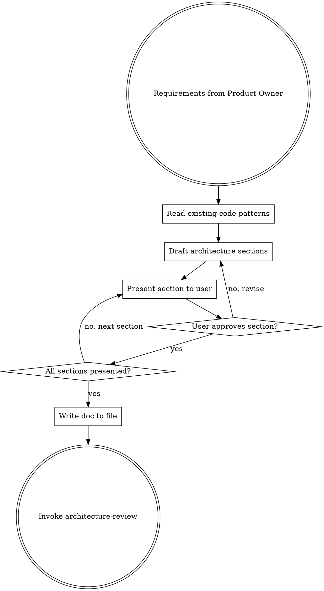
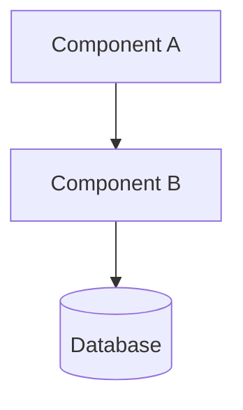
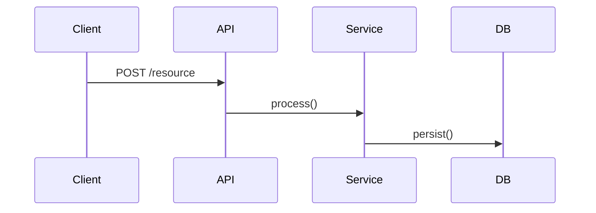
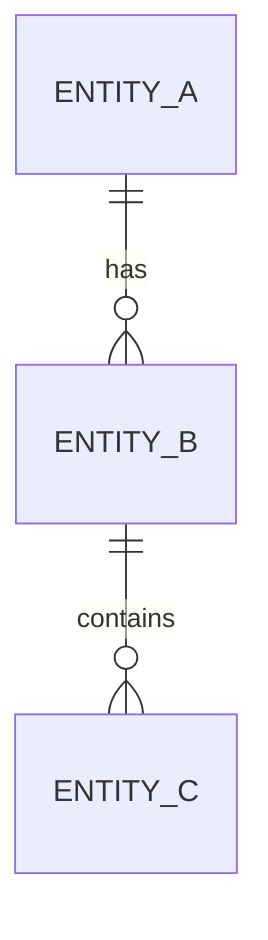

# Architecture Doc

Create a structured architecture document with mermaid diagrams for medium+ tasks. Invoke via `/architect` or automatically after Product Owner for medium/large tasks.

**Announce at start:** "I'm using the Architecture Doc skill to create the system design."

<HARD-GATE>
Every architecture doc MUST have at least one mermaid diagram. Do not skip this requirement regardless of task simplicity. If the task is too simple for a diagram, it's too simple for an architecture doc — use the small task pipeline instead.
</HARD-GATE>

## Output Location

Doc output path precedence:
1. CLAUDE.md configured docs path (if specified)
2. `docs/arch/YYYY-MM-DD-<topic>.md` at project root (created if `docs/arch/` doesn't exist)

**Never** write to any framework-specific subfolder.

## The Process

## Template

Every architecture doc follows this structure. Scale each section to its complexity — a few sentences if straightforward, detailed if nuanced.

~~~markdown
# Architecture: <Feature Name>
Date: YYYY-MM-DD
Status: Draft | Under Review | Approved

## Context
Why are we building this? Business driver, problem statement.
Link to Jira ticket if applicable.

## Requirements
Functional and non-functional requirements validated in Product Owner phase.

## System Design

### Component Diagram

### Sequence Diagram

### Data Model (when applicable)

## Domain Considerations
Only include sections relevant to detected domains. Omit irrelevant ones.

### Healthcare (if applicable)
- PHI handling approach
- OMOP CDM mappings required
- Compliance notes (HIPAA, IRB)

### Data Pipeline (if applicable)
- Idempotency strategy
- Ordering guarantees
- Error/retry/DLQ approach

### Infrastructure (if applicable)
- AWS services and their roles
- Scaling considerations
- Cost implications

## Testing Approach
Which strategy applies to each component:
- Core logic → unit tests
- APIs → contract + integration tests
- Pipelines → integration with Testcontainers
- Database → integration with Testcontainers
- AWS → integration with Localstack
- Trivial → skip or smoke test

## Decisions & Trade-offs
Key choices made and why. What was considered and rejected.

## Out of Scope
What this does NOT cover — prevents scope creep.
~~~

## Mermaid Diagram Guidelines

- **Component diagrams** (`graph TD`): Show how services/modules connect
- **Sequence diagrams** (`sequenceDiagram`): Show request flows and interactions
- **ER diagrams** (`erDiagram`): Show data model relationships
- **State diagrams** (`stateDiagram-v2`): Show state machines when applicable
- Use at least one, typically two diagrams per doc
- Keep diagrams focused — split complex systems into multiple diagrams

## Working in Existing Codebases

- Explore current structure before proposing changes
- Follow existing patterns and conventions
- If existing code has problems that affect this work, include targeted improvements
- Don't propose unrelated refactoring

## Key Principles

- **Present sections incrementally** — get approval section by section
- **Mermaid is mandatory** — at least one diagram per doc
- **Scale to complexity** — short sections for simple parts, detailed for complex
- **Domain-aware** — include only relevant domain sections
- **YAGNI** — don't design for hypothetical future requirements
