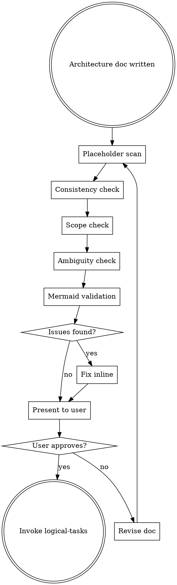

# Architecture Review

Self-review the architecture doc for quality, then gate on user approval before moving to implementation planning.

**Announce at start:** "I'm using the Architecture Review skill to validate the design."

## The Process



## Self-Review Checklist

Run these checks against the architecture doc:

### 1. Placeholder Scan
Search for: "TBD", "TODO", "later", "fill in", incomplete sentences, empty sections, vague requirements like "appropriate error handling."

**If found:** Fix them with concrete content. If you can't determine the right content, flag it for the user.

### 2. Internal Consistency
- Do the mermaid diagrams match the text descriptions?
- Do component names match between sections?
- Does the testing approach align with the components described?
- Do domain considerations match the detected domains?

**If inconsistent:** Fix the contradiction — pick one truth and make it consistent.

### 3. Scope Check
- Is this focused enough for a single implementation plan?
- Could this be broken into independent sub-projects?
- Are there hidden dependencies between sections?

**If too broad:** Recommend decomposition to the user before proceeding.

### 4. Ambiguity Check
- Could any requirement be interpreted two different ways?
- Are there implicit assumptions not stated?
- Are success criteria measurable?

**If ambiguous:** Pick the most reasonable interpretation, make it explicit, and flag for user confirmation.

### 5. Mermaid Validation
- Does every diagram accurately reflect the design?
- Are component names consistent with the text?
- Is at least one diagram present?

**If missing/wrong:** Fix the diagram to match the design.

## User Gate

After self-review, present the doc to the user:

```
Architecture doc reviewed and saved to `<path>`.

Self-review passed:
- No placeholders
- Internally consistent
- Focused scope
- No ambiguity
- Diagrams validated

Please review and let me know if you want changes before we proceed to task decomposition.
```

**Wait for explicit user approval.** Do not proceed to logical-tasks until the user confirms.

## Key Principles

- **Fix issues inline** — don't just flag them, fix them
- **Be specific** — "Section X contradicts Section Y because..." not "there might be issues"
- **User gate is mandatory** — never skip to logical-tasks without approval
- **Re-review after changes** — if the user requests changes, run the checklist again
