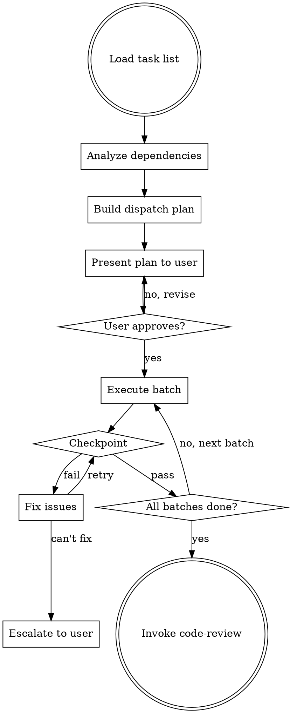

# Implementation Phase — Adaptive Subagent Dispatch

Execute logical tasks through subagents. Analyzes dependencies to dispatch work in parallel where possible, sequential where required. Never auto-starts — waits for user confirmation.

**Announce at start:** "I'm using the Implementation Phase skill to execute the task plan."

<HARD-GATE>
NEVER auto-start subagents. Always present the dispatch plan and wait for explicit user confirmation before executing ANY task.
</HARD-GATE>

## The Process



## Dispatch Plan Presentation

Before any work begins, present:

```
Ready to execute:
  Batch 1 (parallel): Task 1 (DB Migration), Task 4 (Kafka Consumer), Task 5 (S3 Service)
  Batch 2 (sequential): Task 2 (Entity Classes) → Task 3 (Repository Layer)
  Batch 3 (after all): Task 6 (Integration Tests)

Each subagent will:
- Read and follow CLAUDE.md conventions
- Follow the architecture doc
- Write tests per the testing matrix
- Commit after completing their task

Proceed? [y/n]
```

## Subagent Prompt Template

Each subagent receives this context:

```
You are implementing a specific task as part of a larger feature.

BEFORE ANY WORK:
1. Read CLAUDE.md in the project root for conventions and patterns
2. Read the architecture doc at [path] — specifically the section relevant to your task
3. Follow existing code patterns in the codebase

YOUR TASK:
[Task spec from logical-tasks — contract, acceptance criteria, constraints, file paths]

TESTING APPROACH:
[Testing strategy for this task type from the testing matrix]
- Testcontainers over mocks for database and messaging
- Localstack for AWS services
- No mocking internal services — mock only external boundaries

GIT RULES:
- Create a logical commit when your task is complete
- Commit message focused on the "why", not the "what"
- No Co-Authored-By lines
- Do NOT push

GUARDRAILS:
- Do NOT modify files outside your task scope
- Do NOT make architectural decisions — follow the architecture doc
- If the architecture doc seems wrong or incomplete, STOP and report back — do not improvise
- If you are blocked by something outside your control, STOP and report back
```

## Dependency Analysis Rules

- Tasks with no unresolved dependencies → **parallel** (dispatch as concurrent subagents)
- Tasks with dependencies → **sequential** (wait for blockers to complete)
- If a task's dependency fails → **skip** that task and report

## Checkpoints

After each task or parallel batch completes:

1. **Compilation check**: Does the code compile/build?
2. **Test check**: Do all tests pass (existing + new)?
3. **Scope check**: Did the subagent only modify files in its task scope?
4. **Convention check**: Does the code follow CLAUDE.md conventions?

### On Checkpoint Failure
- Agent attempts to fix the issue (one attempt)
- If fix succeeds → continue to next batch
- If fix fails → **stop and escalate to user** with clear error description

## Handling Subagent Reports

| Status | Action |
|--------|--------|
| **DONE** | Run checkpoint, proceed if pass |
| **DONE_WITH_CONCERNS** | Review concerns, run checkpoint, flag concerns to user if significant |
| **BLOCKED** | Stop pipeline, escalate to user with blocker details |
| **ARCHITECTURE_ISSUE** | Stop pipeline, present the issue, ask user if architecture doc needs revision |

## Completion

After all batches complete and checkpoints pass:

```
Implementation Phase complete — N tasks executed successfully.

Summary:
- [Task 1]: Completed — [brief description]
- [Task 2]: Completed — [brief description]
...

Invoking Code Review skill.
```

Then invoke the `siddhi:code-review` skill.

## Key Principles

- **Never auto-start** — always get user confirmation
- **CLAUDE.md first** — every subagent reads project conventions
- **Architecture doc is law** — subagents follow it, don't improvise
- **Escalate, don't improvise** — when blocked or confused, stop and ask
- **Checkpoints catch drift** — verify after every batch
