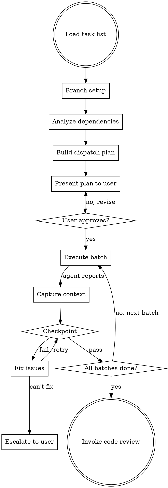

# Implementation Phase — Adaptive Subagent Dispatch

Execute logical tasks through subagents. Analyzes dependencies to dispatch work in parallel where possible, sequential where required. Never auto-starts — waits for user confirmation.

**Announce at start:** "I'm using the Implementation Phase skill to execute the task plan."

<HARD-GATE>
NEVER auto-start subagents. Always present the dispatch plan and wait for explicit user confirmation before executing ANY task.
</HARD-GATE>

## The Process



## Step 1: Branch Setup (BEFORE any code work)

<HARD-GATE>
Branch setup MUST happen before any subagent is dispatched or any code is written. This is the first action after loading the task list.
</HARD-GATE>

1. **Check current branch**: `git branch --show-current`
2. **If on `develop`, `master`, or `main`**:
   - Pull latest: `git pull origin <branch>`
   - Create feature branch: `git checkout -b feature/<jira-ticket>-<short-description>`
3. **If already on a feature branch**: Verify it's up to date, continue working on it
4. **Confirm to user**: "Created branch `feature/<name>` from latest `develop`. Ready to proceed."

```
Branch setup:
  Current branch: develop
  Action: Pulled latest → Created feature/PROJ-123-add-patient-api

Ready to present dispatch plan.
```

## Step 2: Dispatch Plan Presentation

Before any work begins, present the plan with agent assignments:

```
Ready to execute:
  Batch 1 (parallel):
    Task 1 (DB Migration)    → sql-developer
    Task 4 (Kafka Consumer)  → kafka-engineer
    Task 5 (S3 Service)      → aws-engineer
  Batch 2 (sequential):
    Task 2 (Entity Classes)  → spring-boot-engineer
    Task 3 (Repository Layer) → spring-boot-engineer
  Batch 3 (after all):
    Task 6 (Integration Tests) → test-automator

Each agent will:
- Read CLAUDE.md, architecture doc, and their task spec
- Follow the Siddhi protocol (report DONE/BLOCKED/ARCHITECTURE_ISSUE)
- Commit after completing their task

Override any agent assignment? Proceed? [y/n]
```

## Agent Selection

After analyzing dependencies, select the right agent for each task:

### Selection Rules

| File Pattern / Signal | Agent |
|---|---|
| `*.java` + Spring annotations | `spring-boot-engineer` |
| `*.py` + FastAPI/Pydantic | `python-fastapi-developer` |
| `*.go` / `go.mod` | `golang-developer` |
| `*.js/*.ts` + Express/Nest/Node | `nodejs-developer` |
| `*.cs` / `*.csproj` | `dotnet-developer` |
| `*.tsx/*.jsx` + React | `react-developer` |
| `*.ts` (non-React) | `typescript-developer` |
| `next.config.*` / app router | `nextjs-developer` |
| Kafka references | `kafka-engineer` |
| SQL migrations / schema | `sql-developer` |
| ETL / Spark / Airflow | `data-pipeline-engineer` |
| ML model / training | `ml-engineer` |
| `*.tf` / `*.tfvars` | `terraform-engineer` |
| `Dockerfile` / `compose` | `docker-engineer` |
| K8s YAML / Helm | `kubernetes-engineer` |
| AWS SDK / SAM / CDK | `aws-engineer` |
| React Native structure | `react-native-developer` |
| `*.dart` / `pubspec.yaml` | `flutter-developer` |
| OMOP / PHI / clinical | `healthcare-engineer` |
| No strong signal | Language-specific fallback or prompt user to choose |

### Selection Process

1. Read the task spec: file paths, contract, constraints, domain tags
2. Match file patterns and domain signals against the table above
3. If multiple agents match, prefer the more specific one (e.g., `nextjs-developer` over `react-developer` for Next.js projects)
4. If no strong signal, use the dominant language's agent as fallback
5. Include the agent assignment in the dispatch plan for user review

## Subagent Dispatch

Since agents already embed the Siddhi protocol, the dispatch context is minimal:

```
ARCHITECTURE DOC: [path to the architecture doc]
YOUR TASK: [full task spec from logical-tasks — contract, acceptance criteria, constraints, file paths]
TESTING APPROACH: [testing strategy for this task type from the testing matrix]
PRIOR TASK CONTEXT: [summaries from completed dependency tasks — see Context Forwarding below]
```

The agent already knows to read CLAUDE.md, follow git rules, and report status. Do not duplicate those instructions.

## Context Forwarding

Agents cannot talk to each other. The coordinator bridges this gap by forwarding structured context from completed tasks to dependent tasks.

### How It Works

After each agent reports DONE or DONE_WITH_CONCERNS, the coordinator captures a **task output summary** — a concise description of what was built, what files were created/modified, and any key decisions or artifacts (table schemas, API contracts, interface signatures).

When dispatching a subsequent task that depends on the completed one, the coordinator includes the summary in the `PRIOR TASK CONTEXT` field.

### What to Capture

From each completed agent's report and committed code, extract:

| What | Example |
|---|---|
| **Files created/modified** | `Created: src/main/resources/db/migration/V003__add_visit_occurrence.sql` |
| **Schemas and contracts** | `Table visit_occurrence: visit_id (BIGINT PK), person_id (BIGINT FK→person), visit_date (TIMESTAMPTZ), visit_concept_id (INT FK→concept)` |
| **Interface signatures** | `VisitRepository extends JpaRepository<VisitOccurrence, Long>` with `findByPersonId(Long)` |
| **API endpoints** | `POST /api/v1/visits → 201, GET /api/v1/patients/{id}/visits → 200 (paginated)` |
| **Config or environment** | `New config key: app.visits.max-page-size=100 in application.yml` |
| **Concerns flagged** | `DONE_WITH_CONCERNS: visit_date column allows NULL — architecture doc unclear on this` |

### What NOT to Capture

- Full file contents (the agent can read the committed files)
- Implementation details that don't affect downstream tasks
- Test code (unless the next task needs to extend those tests)

### Dispatch Example with Context

```
ARCHITECTURE DOC: docs/arch/2026-04-05-patient-visit-api.md

PRIOR TASK CONTEXT:
  Task 1 (sql-developer, DONE):
    Created V003__add_visit_occurrence.sql
    Schema: visit_occurrence(visit_id BIGINT PK, person_id BIGINT FK→person,
            visit_date TIMESTAMPTZ NOT NULL, visit_concept_id INT FK→concept,
            visit_type_concept_id INT, created_at TIMESTAMPTZ, updated_at TIMESTAMPTZ)
    Index: idx_visit_occurrence_person_id ON visit_occurrence(person_id)

YOUR TASK:
  Task 2: Create JPA entity classes matching the visit_occurrence schema.
  [full task spec...]

TESTING APPROACH: Integration tests with Testcontainers PostgreSQL
```

### Parallel Batch Context

For tasks in a parallel batch (no dependencies on each other), `PRIOR TASK CONTEXT` contains summaries from all previously completed batches — not from other tasks in the same batch.

```
Batch 1 (parallel): Task 1, Task 4, Task 5 → all complete with summaries captured
Batch 2 (sequential): Task 2 gets context from Task 1 (its dependency)
                       Task 3 gets context from Task 1 AND Task 2
Batch 3: Task 6 gets context from all prior tasks
```

## Dependency Analysis Rules

- Tasks with no unresolved dependencies → **parallel** (dispatch as concurrent subagents)
- Tasks with dependencies → **sequential** (wait for blockers to complete)
- If a task's dependency fails → **skip** that task and report

## Checkpoints

After each task or parallel batch completes:

1. **Compilation check**: Does the code compile/build?
2. **Test check**: Do all tests pass (existing + new)?
3. **Scope check**: Did the subagent only modify files in its task scope?
4. **Convention check**: Does the code follow CLAUDE.md conventions?

### On Checkpoint Failure
- Agent attempts to fix the issue (one attempt)
- If fix succeeds → continue to next batch
- If fix fails → **stop and escalate to user** with clear error description

## Handling Subagent Reports

| Status | Action |
|--------|--------|
| **DONE** | Capture output summary for context forwarding, run checkpoint, proceed if pass |
| **DONE_WITH_CONCERNS** | Capture output summary (include concerns), review concerns, run checkpoint, flag concerns to user if significant |
| **BLOCKED** | Stop pipeline, escalate to user with blocker details |
| **ARCHITECTURE_ISSUE** | Stop pipeline, present the issue, ask user if architecture doc needs revision |

After DONE or DONE_WITH_CONCERNS: always capture the task output summary (schemas, contracts, files, key decisions) before moving to the checkpoint. This summary feeds into context forwarding for dependent tasks.

## Completion

After all batches complete and checkpoints pass:

```
Implementation Phase complete — N tasks executed successfully.

Summary:
- [Task 1]: Completed — [brief description]
- [Task 2]: Completed — [brief description]
...

Invoking Code Review skill.
```

Then invoke the `siddhi:code-review` skill.

## Key Principles

- **Never auto-start** — always get user confirmation
- **CLAUDE.md first** — every subagent reads project conventions
- **Architecture doc is law** — subagents follow it, don't improvise
- **Escalate, don't improvise** — when blocked or confused, stop and ask
- **Checkpoints catch drift** — verify after every batch
