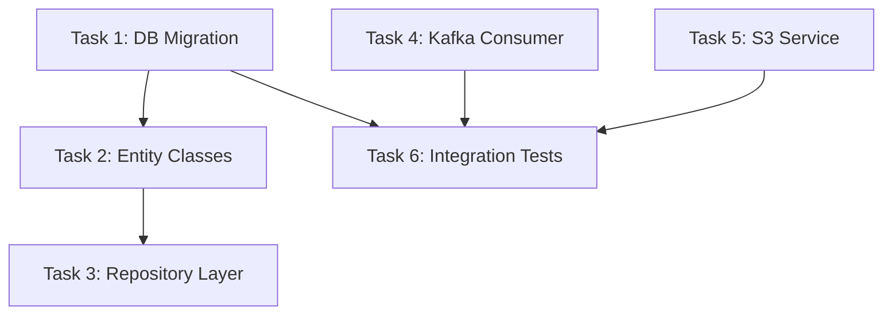

# Logical Tasks — Task Decomposition

Break the approved architecture into discrete, implementable tasks. Each task specifies WHAT to build (contracts + acceptance criteria), not HOW (no code bodies).

**Announce at start:** "I'm using the Logical Tasks skill to decompose the architecture into implementation tasks."

## The Process

1. **Read the architecture doc** — understand all components, their relationships, and the testing approach
2. **Identify natural task boundaries** — each task should produce a self-contained, testable change
3. **Map dependencies** — which tasks must complete before others can start
4. **Write task specs** — contracts, acceptance criteria, file paths
5. **Present to user** — show the task list with dependency graph
6. **User approves** — then invoke the implementation skill

## Task Format

Each task specifies WHAT, not HOW:

```markdown
### Task N: <Component Name>

**Why:** How this connects to the architecture rationale
**Files:**
- Create: `exact/path/to/file.java`
- Modify: `exact/path/to/existing.java`
- Test: `exact/path/to/test/file.java`

**Contract:**
- Interface/class signatures (no method bodies)
- Expected input/output types
- API endpoints if applicable

**Acceptance Criteria:**
- [ ] Observable behavior 1
- [ ] Observable behavior 2
- [ ] Test expectation (what to test, not test code)

**Constraints:**
- Architectural rules to follow
- Existing patterns to match
- Domain-specific rules (HIPAA, idempotency, etc.)

**Dependencies:** Task X, Task Y (must complete first)
```

## Rules

- **No full code bodies** — leave implementation judgment to the executor
- **No duplicated test ceremony** — don't prescribe RED-GREEN-REFACTOR steps; the executor decides the testing approach based on the testing matrix
- **Contracts, not implementations** — type signatures, interfaces, expected behaviors
- **Exact file paths** — every task specifies exactly which files to create/modify
- **Small enough** — each task should be completable in a single focused session
- **Independent where possible** — maximize parallelization opportunities

## Dependency Graph

Present a mermaid dependency graph showing which tasks can run in parallel vs. sequentially:

~~~markdown


**Execution plan:**
- Batch 1 (parallel): Task 1, Task 4, Task 5
- Batch 2 (sequential after Task 1): Task 2 → Task 3
- Batch 3 (after all): Task 6
~~~

## Testing Strategy per Task

Reference the testing matrix to specify what kind of tests each task needs:

| Task Type | Testing Approach |
|-----------|-----------------|
| Core business logic | Unit tests (JUnit) |
| REST endpoints | Contract + integration tests (MockMvc, RestAssured) |
| Data pipeline components | Integration tests (Testcontainers for Kafka) |
| Database operations | Integration tests (Testcontainers for PostgreSQL/MySQL) |
| AWS integrations | Integration tests (Localstack) |
| Clinical data workflows | Integration + data quality assertions |
| Config/boilerplate | Smoke test or skip |

## Handoff to Implementation

After user approves the task list:

```
Task decomposition complete — N tasks identified.

Execution plan:
  Batch 1 (parallel): [tasks]
  Batch 2 (sequential): [tasks]
  Batch 3 (after all): [tasks]

Invoking the Implementation Phase skill. Subagents will NOT start automatically — you'll see the dispatch plan first for approval.
```

Then invoke the `siddhi:implementation` skill.

## Key Principles

- **Contracts over code** — specify interfaces, not implementations
- **Maximize parallelism** — design tasks to be independent where possible
- **Exact paths** — no ambiguity about what files to touch
- **Right-sized** — not so small they're trivial, not so large they're multi-session
- **Testability built in** — every task has clear acceptance criteria
