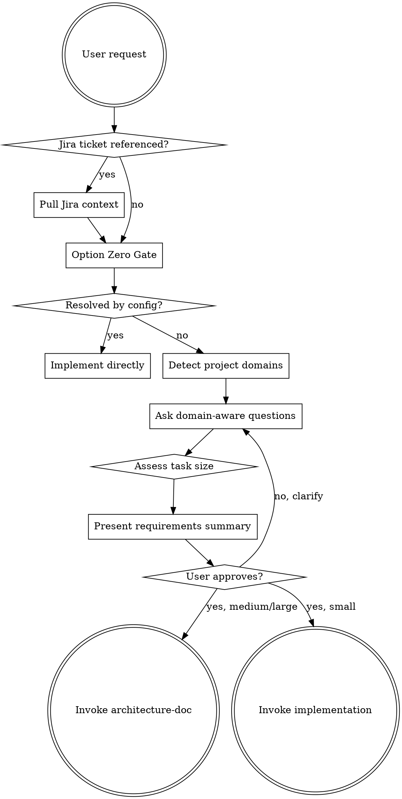

# Product Owner — Requirements Discovery

Discover what the user actually needs through structured questioning. Auto-triggers when building something, or invoke manually via `/discover`.

**Announce at start:** "I'm using the Product Owner skill to discover requirements."

<HARD-GATE>
Do NOT proceed to architecture, planning, or implementation until requirements are validated and the user has confirmed them. This applies to EVERY task regardless of perceived simplicity.
</HARD-GATE>

## Option Zero Gate

Before proposing ANY solutions, ask these three forcing questions:

1. **Can configuration alone fix this?** (env vars, dependency versions, settings, feature flags)
2. **Does this require code changes at all?** (could it be a config, migration, or operational fix?)
3. **What's the simplest non-code solution?**

If any yields a viable answer with evidence, that becomes the recommendation. Skip architecture doc — go straight to implementation.

### When Option Zero Resolves It

```
Option Zero resolved this — the fix is a configuration change:
  [describe the fix]

Shall I implement this directly? No architecture doc needed.
```

## The Process



## Jira Integration

When user references a Jira ticket (e.g., "implement PROJ-123"):
1. Use MCP Jira tools to pull ticket summary, description, acceptance criteria
2. Use ticket context to inform Option Zero and requirements questions
3. Reference the ticket ID in branch naming: `feature/PROJ-123-<description>`

## Domain-Aware Questions

After Option Zero, scan the project for domain indicators and ask relevant questions.

### Healthcare (when OMOP/clinical code detected)
- Does this feature handle PHI (Protected Health Information)?
- Is OMOP CDM concept mapping required?
- Are there compliance implications (HIPAA, IRB)?
- What clinical data quality checks are needed?

### Java/Spring Boot (when pom.xml or build.gradle detected)
- Which Spring modules are involved? (Web, Data JPA, Security, etc.)
- What are the transaction boundaries?
- REST API versioning considerations?
- Existing service patterns to follow?

### Data Pipelines (when Kafka in dependencies)
- What ordering guarantees are needed?
- Idempotency requirements for consumers?
- Error handling strategy (DLQ, retry, skip)?
- Expected throughput and backpressure handling?

### Cloud/AWS (when AWS SDK detected)
- Which AWS services are involved?
- Cost implications at expected scale?
- Cold start / latency requirements?
- Existing deployment patterns (SAM, CDK, manual)?

## Task Size Assessment

After gathering requirements, assess task size:

| Signals | Size | Next Step |
|---------|------|-----------|
| Config change, env var, single-line fix | **Trivial** | Implement directly |
| Bug fix, single file, simple CRUD | **Small** | Skip to implementation skill |
| New endpoint, service method, moderate scope | **Medium** | Invoke architecture-doc skill |
| New service, multi-component, cross-cutting | **Large** | Invoke architecture-doc skill |

## Requirements Summary

Present a structured summary for user approval:

```markdown
## Requirements Summary

**What:** [One sentence]
**Why:** [Business driver]
**Task Size:** Trivial | Small | Medium | Large

### Functional Requirements
1. [requirement]
2. [requirement]

### Non-Functional Requirements
- Performance: [if applicable]
- Security: [if applicable]
- Compliance: [if applicable]

### Domain Considerations
- [relevant domain notes]

### Out of Scope
- [explicitly excluded items]

**Next step:** [Architecture Doc | Direct Implementation]
```

Wait for user approval before proceeding.

## Key Principles

- **One question at a time** — don't overwhelm
- **Multiple choice preferred** — easier to answer
- **Option Zero first** — always check for the simple fix
- **Domain-aware** — ask questions relevant to detected project domains
- **YAGNI ruthlessly** — remove unnecessary requirements
- **Adaptive** — scale the process to task size
