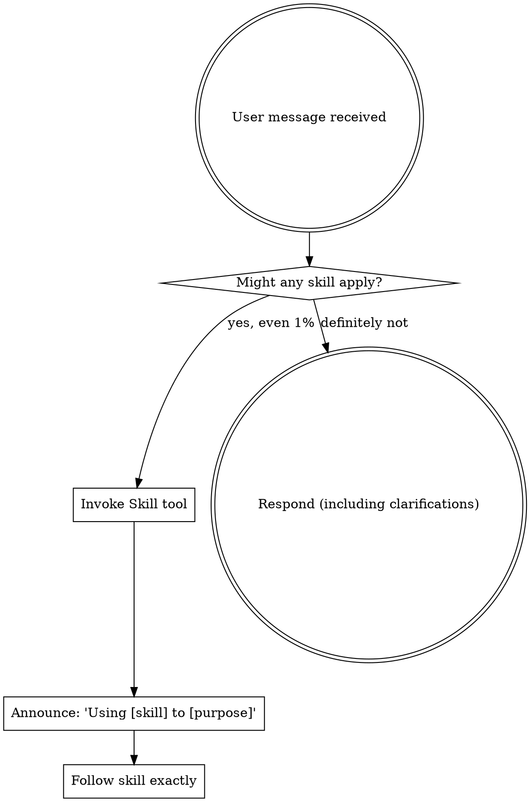

<SUBAGENT-STOP>
If you were dispatched as a subagent to execute a specific task, skip this skill.
</SUBAGENT-STOP>

<EXTREMELY-IMPORTANT>
If you think there is even a 1% chance a skill might apply to what you are doing, you ABSOLUTELY MUST invoke the skill.

IF A SKILL APPLIES TO YOUR TASK, YOU DO NOT HAVE A CHOICE. YOU MUST USE IT.

This is not negotiable. This is not optional. You cannot rationalize your way out of this.
</EXTREMELY-IMPORTANT>

## Instruction Priority

Siddhi skills override default system prompt behavior, but **user instructions always take precedence**:

1. **User's explicit instructions** (CLAUDE.md, direct requests) — highest priority
2. **Siddhi skills** — override default system behavior where they conflict
3. **Default system prompt** — lowest priority

If CLAUDE.md says "don't write architecture docs" and a skill says "always write architecture docs," follow the user's instructions. The user is in control.

## How to Access Skills

Use the `Skill` tool. When you invoke a skill, its content is loaded and presented to you — follow it directly. Never use the Read tool on skill files.

## The Siddhi Pipeline

```
Product Owner → Architecture Doc → Architecture Review → Logical Tasks → Implementation Phase → Code Review
                     ↓                   ↓                                      ↓                    ↓
                 architect           arch-reviewer                       agent-selector         multi-reviewer
                  agent                agent                          picks specialized          dispatch
                                                                    implementer agents
```

### Agent Dispatch Points

| Pipeline Stage | Agent(s) Dispatched |
|---|---|
| Architecture Doc | `architect` specialist (medium/large tasks) |
| Architecture Review | `architecture-reviewer` (automated review before user gate) |
| Implementation | Agent selector picks from `implementers/*` based on task file patterns |
| Code Review | `code-reviewer` + tier-based additional reviewers |
| Debugging (support) | `debugger` specialist |
| Verification (support) | `test-automator` specialist |

### Agent Roles

- **Implementers** (`agents/implementers/`): Build things — backend, frontend, data, infra, mobile, domain specialists
- **Reviewers** (`agents/reviewers/`): Review things — code, security, performance, architecture
- **Specialists** (`agents/specialists/`): On-demand expertise — architect, debugger, test-automator, api-designer, database-architect

### Adaptive Scaling

Not every task needs the full pipeline:

| Task Size | Pipeline |
|-----------|----------|
| **Trivial** (config, env var, typo) | Option Zero resolves it → fix → commit |
| **Small** (bug fix, single-file) | Product Owner → implement (with agent) → quick review → commit |
| **Medium** (new endpoint, method) | Product Owner → Architecture Doc (architect agent) → implement (with agents) → standard review → commit |
| **Large** (new service, multi-component) | Full pipeline with formal review gates and multi-reviewer dispatch |

## Using Skills

### The Rule

**Invoke relevant or requested skills BEFORE any response or action.** Even a 1% chance a skill might apply means you should invoke the skill to check.



### Skill Priority

When multiple skills could apply:

1. **Process skills first** (product-owner, debugging) — determine HOW to approach
2. **Pipeline skills second** (architecture-doc, logical-tasks, implementation) — guide execution
3. **Domain skills** (healthcare, java-spring, data-pipelines, cloud-aws) — invoked within pipeline stages for questions and checklists
4. **Agent dispatch** — skills dispatch appropriate agents; agents carry the deep domain expertise

### Domain Auto-Detection

Siddhi scans the project to activate relevant domain skills:
- `pom.xml` or `build.gradle` present → activate `java-spring`
- OMOP/clinical references in code → activate `healthcare`
- `kafka` in dependencies/config → activate `data-pipelines`
- AWS SDK or SAM templates → activate `cloud-aws`

## Git Workflow Rules

These rules apply to ALL work done through Siddhi:

1. **Branch management**: If on `develop` or `master/main` → pull latest → create feature branch (`feature/<jira-ticket>-<short-description>`)
2. **Logical commits**: One commit per logical task, meaningful messages focused on the "why"
3. **No `Co-Authored-By`**: Clean commit messages without attribution lines
4. **No push. Ever.** Stop after commit and request user to push:

```
Changes committed to feature/<branch-name> (N commits).
Ready for your review. Please push when satisfied:
  git push -u origin feature/<branch-name>
```

## Red Flags

These thoughts mean STOP — you're rationalizing:

| Thought | Reality |
|---------|---------|
| "This is just a simple question" | Questions are tasks. Check for skills. |
| "I need more context first" | Skill check comes BEFORE clarifying questions. |
| "Let me explore the codebase first" | Skills tell you HOW to explore. Check first. |
| "This doesn't need a formal skill" | If a skill exists, use it. |
| "The skill is overkill" | Simple things become complex. Use it. |
| "I'll just do this one thing first" | Check BEFORE doing anything. |

## Skill Types

**Rigid** (debugging, verification): Follow exactly. Don't adapt away discipline.

**Flexible** (architecture-doc, domain skills): Adapt principles to context.

The skill itself tells you which.
